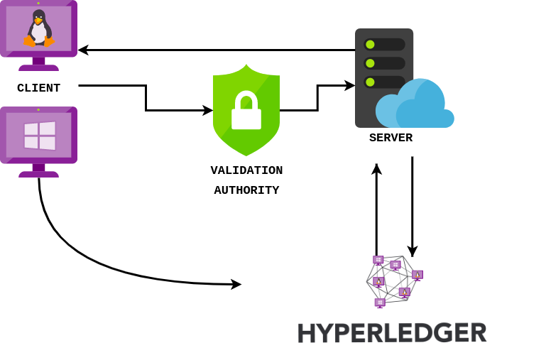
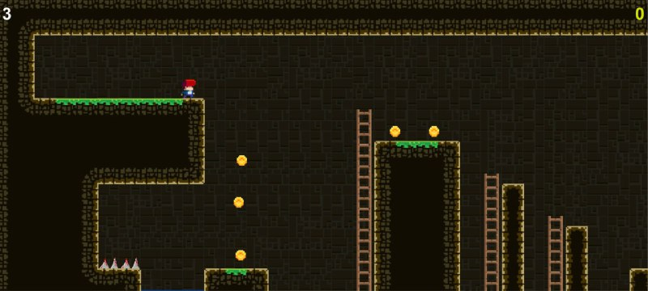

# Honey-Chain-MMORPG-Blockchain-based-game
An MMORPG Blockchain based game

*Marcello Politi*,
*Samir Salman*,
*Simone Giorgioni*

## Descrizione progetto

Il progetto consiste nel design e lo sviluppo di un **videogame multiplayer** che permette agli utenti lo scambio e l'acquisto di oggetti di gioco. Il videogioco appartiene alla categoria dei **Multiplayer Online Role-Playing Game**. Lo scambio e l'acquisto di oggetti saranno tracciati da una Hyperledger Fabric mediante il **World State e Transaction Logs** della stessa.
Inoltre ogni client comunicherà con il server tramite servizi nodeJS e il ruolo dei vari giocatori (che equivale al loro livello nel gioco e/o admin permission) verrà gestito tramite **Validation Authority** in ambiente **LISP**, la quale inoltre si occuperà di effetturà il logging degli utenti all'interno della rete.

## Glossario

- **Multiplayer Online Role-Playing Game**: Videogioco multiplayer online nel quale i giocatori interagiscono tra loro tramite rete.

- **World State**: Componente della Hyperledger Fabric. Tiene conto del valore corrente di un attributo appartenente ad un oggetto del mondo, come se fosse uno stato Ledger unico.

- **Transaction Log**: Componente della Hyperledger Fabric. Contiene tutte le transazioni effettuate dagli utenti.

- **Servizi NodeJS**: API che modellano la comunicazione client-server, codificate in NodeJS

- **Unity**: Game Engine basato sullo scripting (C#).

- **Permissioned**: Sono dei network di blockchain nelle quali l'accesso è protetto.

- **JWT**: É uno standard open (RFC 7519) che definisce uno schema in formato JSON per lo scambio di informazioni tra vari servizi.

## Architettura
Il client corrisponde all'istanza di videogame (**Unity**), comunica mediante API HTTP con la validation authority (invisibile al client), che si occuperà di verificare il **ruolo** dell'utente e lo reindirizzerà al server. Inoltre al fine di consentire la multiplayer mode, i client comunicheranno la propria posizione all'interno del **game world** tramite **WebSocket**. Infine utilizzeremo Hyperledger Fabric per registrare e verificare le transazioni e gli smart contract per la gestione degli oggetti di gioco.   

## Scenario di Gioco

Ogni giocatore avrà un proprio stato costituito da:
- **Livello**: caratterizzato da punti esperienza, armi ecc..
- **Armi**: ognuna avrà un proprio valore in base alla rarità
- **Vita**: ogni giocatore avrà un proprio livello di vita
- **Monete**: rappresentano la moneta all'interno del gioco, per l'acquisto e lo scambio di armi
- **Caratteristiche generale** : come ad esempio colore dei capelli, armatura e tutto ciò che concerne la personalizzazione del personaggio

### Scontro tra utenti

Lo scontro tra due utenti, a seguito della vittoria di uno dei due avverrà una transazione di armi (o monete) dall'utente sconfitto al vincitore. Inoltre ogni utente potrà acquistare armi tramite le proprie monete (**transazione**). Ogni arma avrà quindi un costo che varierà in base alla rarità e alle caratteristiche della stessa.

### Scambio di oggetti tra utenti

Gli utenti potranno inoltre scambiare tra loro gli oggetti collezionati durante il gioco, per farlo verranno utilizzate le **transazioni su channel privato**, in modo da creare una strategia di alleanza invisibile agli altri utenti.

### Accesso alle aree protette

Nel **World Game** ci saranno delle aree nelle quali l'accesso è consentito solo ad utenti di un determinato livello (o > di un livello), gestiremo l'accesso alle aree protette mediante i ruoli nella Validation Authority.

# Sotto Progetti

## SDC

La parte di SDC sarà quella di progettare e realizzare una Validation Authority che si interporra trà Client e Server e si occuperà della gestione degli accessi alle aree protette mediante le Access e le Validation Rules. Ogni giocatore avrà un ruolo diverso in base al proprio livello di gioco. La parte Client sarà quindi un videogame realizzato tramite Unity, mentre la parte Server sarà realizzata in NodeJS e gestirà l'autenticazione degli utenti tramite **JWT**. Ad ogni client corrisponderà un nodo all'interno di Hyperledger Fabric Network.

## SCRS

La parte di progetto di SCRS consisterà nella gestione di una rete Hyperledger Fabric che ci permetterà di gestire il concetto di acquisto e scambio di oggetti di gioco tramite transazioni, inoltre ci permetterà di avere un utenza trusted grazie alla caratteristica **Permissioned** di Hyperledger Fabric. Ogni utente costituisce un nodo all'interno della rete.
Ogni azione dei client avviene mediante degli **smart contract** scritti ad-hoc.
